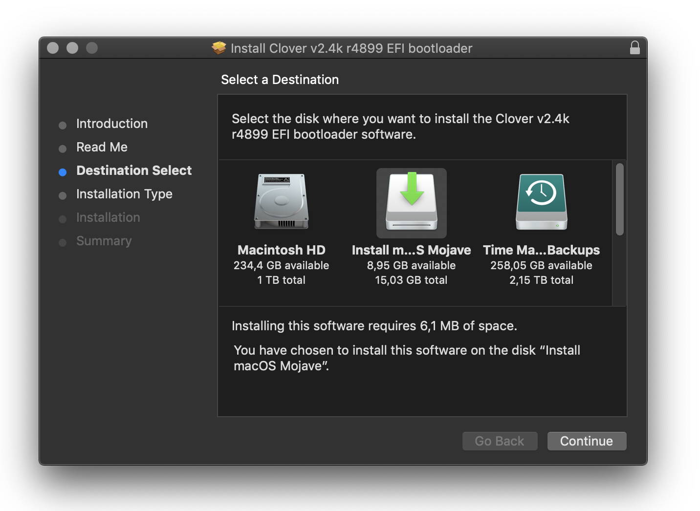
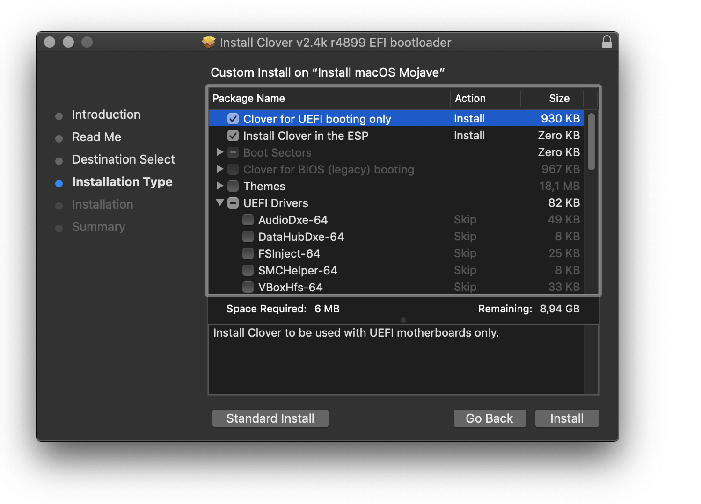
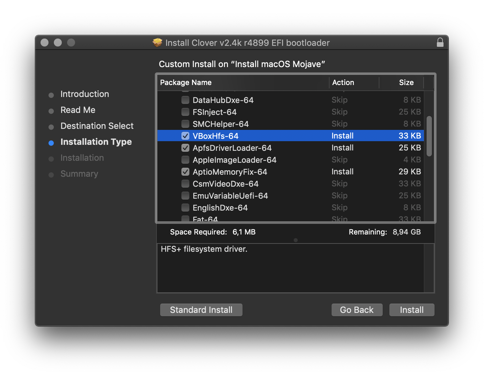
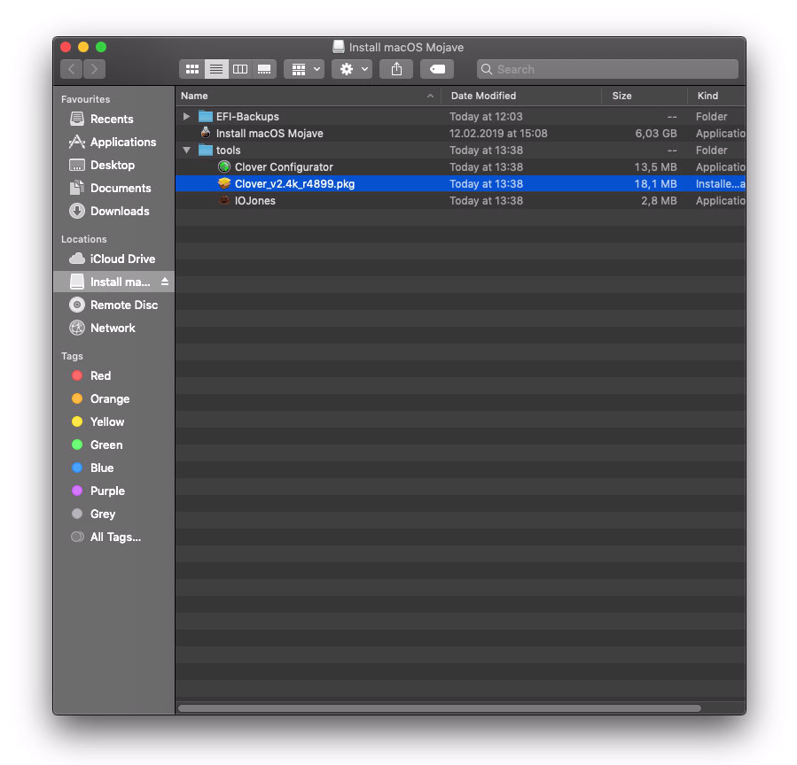
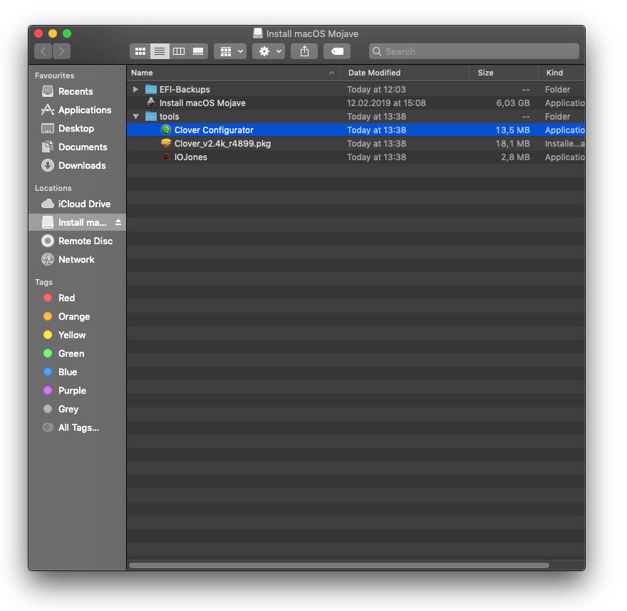
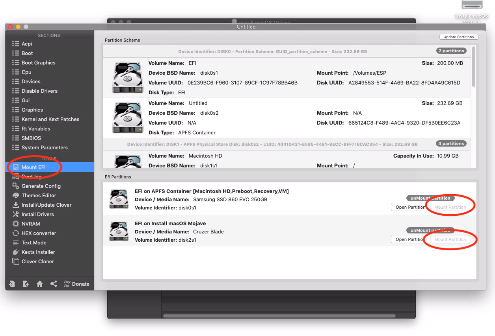

# Hackinthosh Setup for Gigabyte Z390 UD
## Using Vanilla Install Method

A vanilla setup implies that the OS itself remains relatively untouched - and that the bulk of the Hackintosh-related kexts, patches, etc are contained on the EFI partition. For all intents and purposes, a vanilla install's main partition is identical to that of an official Apple computer.

Most Infos grabbed from <https://hackintosh.gitbook.io/-r-hackintosh-vanilla-desktop-guide/>
Good Video: <https://www.youtube.com/watch?v=fA9AotXqkqA>

## Creating USB Install Disk

Once you have your 8+GB USB installer, we need to make sure it's set up properly. If you don't plan on patching the installer \(and I don't\) - you want the USB setup the following way:

* GUID Partition Map
* 1 Partition
* OS X Extended \(Journaled\)

To do this, fire up the Terminal \(located in `/Applications/Utilities`\) and type `diskutil list`.

This will give you a list of all the connected disks and their partitions. Take note of the disk identifier for your USB drive. **DO NOT GUESS THIS AS WE ARE ABOUT TO ERASE IT!** Then run the following replacing `disk#` with your actual identifier:

#### Partition and format Stick
```text
diskutil partitionDisk /dev/disk# GPT JHFS+ "USB" 100%
```

This will partition the disk as listed above and rename it to "USB".

You can now run the corresponding command from [Apple's own instructions](https://support.apple.com/en-us/HT201372) - for this example, we'll be using the Mojave command:

#### Copy macOS Install content to stick

```text
sudo "/Applications/Install macOS Mojave.app/Contents/Resources/createinstallmedia" --volume /Volumes/USB
```

_This will take some time, and it doesn't output much for status updates._ It can take upwards of 30-40 minutes, so just be patient.  Grab a cup of coffee, read the news, catch up with friends and family - you'll be here for a bit

When this completes, you will have a USB installer that can boot on a _real Mac_. We just need to get the Hackintosh-related stuff set up, and we'll be in business!

### Installing Clover Boot Manager

Fire up your Clover install package ```open tools/Clover_v2.4k_r4899.pkg```. On the 2nd page of the installer **make sure to select your USB as the destination**. We also want to **Customize** the installation - as the defaults are pretty lackluster.



The _usual_ options you want to check in the Customize menu are shown in the following screenshots with an explanation of each after \(**Note**: any non-Z370 300-series board will need _EmuVariableUefi-64_ as well\):





* _Install Clover for UEFI booting only_
* _Install Clover to the ESP_
* Under _UEFI Drivers:_
  * _AptioMemoryFix_ \(the new hotness that includes NVRAM fixes, as well as better memory management\)
  * _VBoxHfs-64_ \(or _HFSPlus_ if available\) - one of these is required for Clover to see and boot HFS+ volumes.  If you see the option to enable it in the installer, make sure it's selected - if you don't see it in the installer, verify that one of them exists in the _EFI -&gt; CLOVER -&gt; drivers64UEFI_ folder
  * _ApfsDriverLoader_ - \(Available in Dids' Clover builds - or [here](https://github.com/acidanthera/ApfsSupportPkg/releases)\) this allows Clover to see and boot from APFS volumes by loading apfs.efi from ApfsContainer located on block device \(if using AptioMemoryFix as well, requires R21 or newer\)

### Delete and copy EFI file from repo

Now we copy all the kexts and settings from our repo to the EFI partition of the stick.

```
cp -r clover_efi/EFI /Volumes/ESP/
cp -r tools /Volumes/Install\ macOS\ Mojave/
```

## Installation
Now boot from the memory stick and install as on a normal Mac.

## After install, Install Clover Bootmanager

At this moment we still using the USB Stick to boot the Macintosh HD. So we need to install the bootloader to our internal HDD. So repeat Step ***Installing Clover Boot Manager*** but now select the internal HDD as destination:




## Copy kexts and settings from Stick to HDD

### Open Clover Configurator

### Mount EFI Partitions


* Remove EFI Folder from HDD and empty trash.
* Copy EFI folder from USB Stick to HDDs EFI.

## Thats it!
Set internal HDD to boot at first and have a lot of fun with your new Hacky!
Hopefully we see a new cool MacPro in June '19 so we doesn't need to do it this way anymore.
